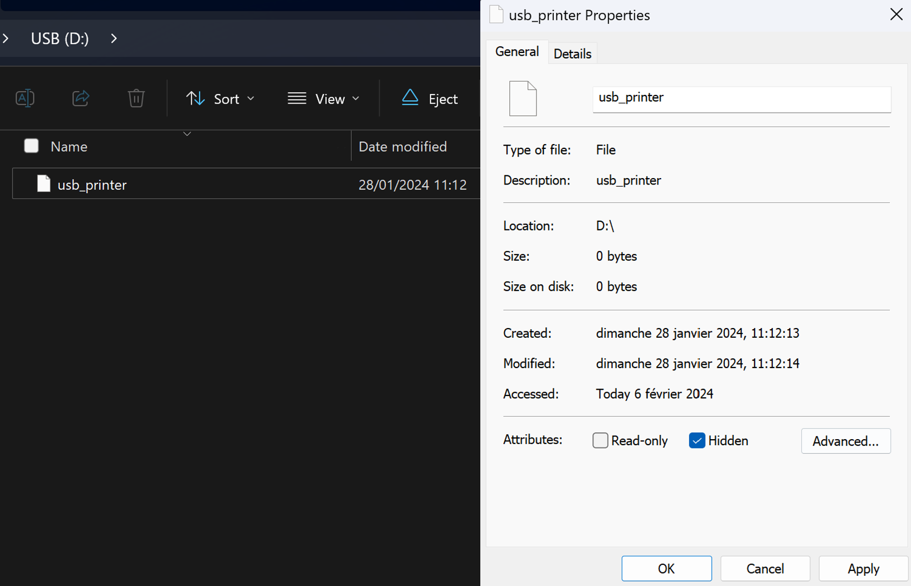
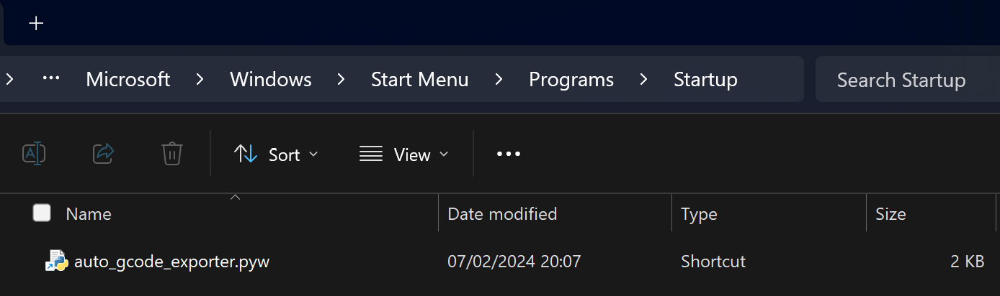

# auto_gcode_exporter
auto_gcode_exporter is a small Python automation script that automatically sends my newest .gcode files to my 3D printer's USB key or SD card when plugged in. This script helps me save approximately 30 seconds each time I need to print something. But hey, a gain is a gain! :D


# How it works
**This script only works on windows machines.**
This script work on a particular folder architecture. Each projects is stored in one directory and each projects contains 3D files (.stl, .3mf) and a `gcodes` directory that will contain every gcode generated by the slicer. 

```
3D Projects/
├─ project1/
│  ├─ gcodes/
│  │  ├─ file1.gcode
│  ├─ file1.stl
├─ project2/
│  ├─ gcodes/
│  │  ├─ file2.gcode
│  ├─ file2.stl
├─ project3/
│  ├─ gcodes/
│  │  ├─ file3.gcode
│  ├─ file3.stl
│  ├─ .ignore

```
The script scans each gcodes directory of every project and checks if gcode files have been updated. If so, those files are moved to a queue, waiting for a storage volume to be plugged in. Once the correct storage volume is plugged in, all files in the export queue are copied onto this storage. You can now unplug the storage volume and you are ready to print! 

## Exclude a project
If you want a project to not be scanned and exported automatically, you can add a file named `.ignore` at the root of the project directory like the `project3` in the example above. 

# Setup
To use this automation, you will need to do multiple things before executing the program.

## Setup the path:
You will need to set a project directory that will contain every projects folder. To do that, simply copy-paste the path of your folder inside the `settings.py` file.
```python
# Absolute path to the folder that contain every projects. 
PROJECTS_FOLDER_PATH = '<YOUR PATH HERE>'
```
## Mark the USB stick or SD card:
For the program to recognize your storage volume, you will need to create a file named `usb_printer` at the root of it. If you want, you can't hide this file in the file properties.

<div align="center">
    


<i align="center">Example of the usb_printer file created at the root of the storage volume and how to hide the file.</i>

</div>

## If you have constantly plugged drives:
To save some CPU cycle, you can add the mounting letter of each constantly plugged in drives in the `EXCLUDED_MOUNTING_LETTER` tuple inside the `settings.py`.

```python
# Mounting letter that doesn't need to be checked to save some CPU cycle. 
# Add every drive that are always connected to your computer such as 
# external drives or optic disc drives here. 
EXCLUDED_MOUNTING_LETTER = ('C', 'D', 'E')
```
In this example, letter `C`, `D` and `E` are excluded and will not be scanned.

## Add file extention support
You can add any file extention that you want the program to support. For example `.nc` file for CNC machines. 
```python
# Gcode extensions that are currently supported, you can add yours.
GCODE_EXTENTION = ('.gcode', '.gco', '.g', '.bgcode', '.bgc', '.ngc')
```


# Execution
When every step above are done you are ready to execute the automation!
```bash
python __main__.py
```

# Start at boot
To execute this script at boot, you will need to move the `auto_gcode_exporter.pyw` inside the `Startup` folder. To access this folder you can open the Windows `Run` menu by pressing `⊞ Win` + `R` and type `shell:startup`. Move the `auto_gcode_exporter.pyw` file inside the opened folder and voila, the script should now run in the background at startup. 

<p align="center">

<i>The file inside the Startup folder.</i>
</p>

If you want to kill the program you can type this command in the powershell: 
```bash
taskkill /f /im pythonw.exe
```


# Licence
- romainflcht